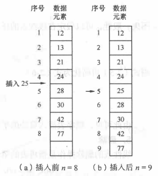
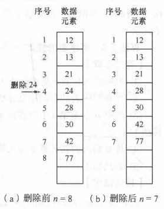

&emsp;
# 线性表的顺序表示和实现
>线性表打印
```c++
void printList(SqList *L)
{
    for (int i = 0; i < L->length; i++)
        printf("%d ", L->data[i]);
    printf("\n");
}
```
&emsp;
# 1 线性表的顺序表示

- 线性表的顺序表示指的是用一组地址连续的存储单元依次存储线性表的数据元素
- 这种表示也称作线性表的顺序存储结构或顺序映像
- 通常，称这种存储结构的线性表为顺序表（Sequential List ）
- 其特点是，逻辑上相邻的数据元素，其物理次序也是相邻的。

假设线性表的每个元素需占用 $1$ 个存储单元，并以所占的第一个单元的存储地址作为数据元素的存储起始位置。则线性表中第 $i+1$ 个数据元素的存储位置 $LOC( a_{i+1})$ 和第 $i$ 个数据元素的存储位置 $LOC(a_i)$之间满足下列关系∶
$$LOC(a_{i+1}) = LOC(a_i) + 1$$

<div align=center>
    <image src='imgs/线性表的顺序存储结构示意图.png' width=300>
</div>


&emsp;
# 2 线性表的顺序实现
## 2.1 初始化
- 顺序表的初始化操作就是构造一个空的顺序表

>步骤
1. 为顺序表 L 动态分配一个预定义大小的数组空间，是 elem 指向这段空间的基地质
2. 将表的当前长度设为 0
>代码
```c++
// （1）初始化
Status InitList(SqList L)
{
    L.data = (ElemType*)malloc(LIST_INIT_SIZE * sizeof(ElemType));
    if (!L.data)
        exit(OVERFLOW);
    L.length = 0;
    L.size   = LIST_INIT_SIZE;
    return OK;
}

```

>注意问题
- 如果想用结构体指针，声明 SqList *L 后，必须给这个指针分配内存
- 否则它仅仅就是一个指针，没有任何实质内容，不能访问它的 data、length、size
```c++
int main()
{
    SqList *L;
    L = (SqList*)malloc(sizeof(SqList));
}
```

&emsp;
## 2.2 取值
- 取值操作是根据指定的位置序号 i，获取顺序表中第 i 个数据元素的值
- 顺序存储结构具有随机存取的特点，可以直接通过数组下标定位得到
>步骤
1. 判断指定的位置序号 i 值是否合理 $(1 \leq i \leq L->length)$ 若不合理，则返回 ERROR
2. 若 i 值合理，则将第 i 个数据元素 L->elem[i-1] 赋值给参数 e，通过 e 返回第 i 个数据元素的传值
>代码
```c++
// （2）取值
Status GetElem(SqList *L, int i, ElemType* e)
{
    if (i < 1 || i > L->length)
        return ERROR;
    printf("%d\n", L->data[i]);
    *e = L->data[i];
    return OK;
}
```

>算法分析
- 顺序表取值算法的时间复杂度为O(1)

&emsp;
## 2.3 查找
查找操作是根据指定的元素值 e，查找顺序表中第 1 个与 e 相等的元素。若查找成功，则返回该元素咋及表中的位置序号；若查找失败，则返回 0。
>步骤
1. 从第一个元素期，依次和 e 相比较，若找到与 e 相等的元素 L->elem[i]，则查找成功，返回该元素的序号 i+1
2. 若查遍整个顺序表都没有找到，则查找失败，返回 0.

>代码
```c++
// （3）查找
int LocateElem(SqList *L, ElemType e)
{
    for (int i = 0; i < L->length; i++)
    {
        if (L->data[i] == e)
            return i;
    }
    return 0;
}
```
>算法分析

顺序表中查找元素，时间主要耗费在数据的比较上，而比较的次数取决于被查元素在线性表中的位置

在查找时，为确定元素在顺序表中的位置，需要和给定值进行比较的数据元素个数的期望值成为查找在查找成功时的平均查找长度（Average Search Length, ASL）

假设 $p_i$ 是查找第 $i$ 个元素的概率，$C_i$ 为找到表中其关键字与给定值相等的第 $i$ 个记录时，和给定值已进行过比较的关键字个数，则在长度为 $n$ 的线性表中，查找成功时的平均查找长度为：
$$ASL = \sum\limits_{i=1}^np_iC_i$$

$C_i$ 取决于所查元素在表中的位置。例如，查找表中第一个记录时，仅需比较一次；而查找表中最后一个记录时，则需比较 n 次。一般情况下 $C_i = i$ 

假设每个元素的查找概率相等，则
$$p_i = 1/n$$
则可简化式子为：
$$ASL = \frac{1}{n}\sum\limits_{i=1}^n i = \frac{n+1}{2}$$

顺序表按值查找算法的平均时间复杂度为 $O(n)$

&emsp;
## 2.4 插入
- 这里默认数组元素个数至少为1
<div align=center>
    
</div>
&emsp;


为了在线性表的第 $5$ 个位置上插入一个值为 $25$ 的数据元素，则需将第 $5$ 个至第 $8$ 个数据元素依次向后移动一个位置。

一般情况下，在第 $i（1\leq n）$个位置插入一个元素时，需从最后一个元素即第 $n$ 个元素开始，依次向后移动一个位置，直至第 $i$ 个元素（共 $n-i+1$ 个元素）。


>步骤
1. 判断插入位置 $i$ 是否合法（$i$ 值的合法范围是 $1\leq i \leq n+1$），若不合法则返回 ERROR
2. 判断顺序表的存储空间是否已满，若满则返回 ERROR
3. 将第 n 个至第 i 个位置的元素一次向后移动一个位置，空出第 i 个位置（i = n+1 时无需移动）
4. 将要插入的新元素 e 放入第 i 个位置
5. 表长加 1
>代码
```c++
// （4）插入
Status ListInsert(SqList *L, int i, ElemType e)
{
    if (&L == NULL)
        return ERROR;
      
    if (i < 0 || i > (L->length))
        return ERROR;
        
    // 如果容量满了，重新分配内存
    ElemType* newbase;
    if (L->length >= L->size)
    {
        newbase = (ElemType*)realloc(L->data, (L->size+LISTINCREMENT)*sizeof(ElemType));
        if (newbase == NULL)
            exit(OVERFLOW);
        L->data = newbase;
        L->size += LISTINCREMENT;
    }

    ElemType *insert_cur, *move_cur;
    // p1 为插入位置
    insert_cur = &(L->data[i]);
    for (move_cur = &(L->data[L->length]); move_cur >= insert_cur; --move_cur)
        *(move_cur + 1) = *move_cur; // 逐个元素后移

    *insert_cur = e;
    L->length++;
    return OK;
}
```

&emsp;
## 2.5 删除

<div align=center>
    
</div>

一般情况下，删除第 $i(1 \leq i \leq n)$ 个元素时，需要将第 $i+1$ 个至第 $n$ 个元素（共 $n-i$ 个元素）依次向前移动一个位置（$i = n$ 时无需移动）

&emsp;
>步骤
1. 判断删除位置 $i$ 是否合法（合法值为 $1 \leq i \leq n$），若不合法则返回 ERROR
2. 将第 $i+1$ 个至第 $n$ 个的元素一次向前移动一个位置$（i=n）$时无序移动
3. 表长减1

&emsp;
>代码
```c++
// （5）删除
Status ListDelete(SqList* L, int i)
{
    if (L == NULL || L->data == NULL)
        return ERROR;
    if (i < 1 || i > L->length)
        return ERROR;
    ElemType *move_cur, *end_cur;
    move_cur = &(L->data[i]);          // 被删除元素的位置
    end_cur  = &L->data[L->length]; // 表尾元素位置

    for (move_cur; move_cur <= end_cur; ++move_cur)
        *move_cur = *(move_cur+1);

    L->length--;
    return OK;
}
```
&emsp;
>算法分析

当在顺序表中某个位置上删除一个数据元素时，其时间主要耗费在移动元素上，而移动元素的个数取决于删除元素的位置。

假设 $p_i$ 是删除第 $i$ 个元素的概率，$E_{det}$ 为在长度为 $n$ 的线性表中删除一个元素时所需移动元素次数的期望值（平均次数），则有


$$E_{det} = \sum\limits_{i=1}^n p_i(n-i)$$

不失一般性，可以假定在线性表的任何位置上删除元素都是等概率的，即
$$p_i = \frac{1}{n}$$
则可以简化为式子：
$$E_{det} = \frac{1}{n}\sum\limits_{i=1}^n(n-1) = \frac{n-1}{2}$$

由此可见，顺序表删除算法的平均时间复杂度为 $O(n)$


&emsp;
# 3 总结
- 顺序表可以随机存取表中任一元素，其存储位置可用一个简单、直观的公式来表示
- 从另一方面来看，这个特点也造成了这种存储结构的缺点∶在做插人或删除操作时，需移动大量元素
- 另外由干数组有长度相对固定的静态特性. 当表中数据元素个数较多日变化较大时，操作过程相对复杂，必然导致存储空间的浪费
- 所有这些问题，都可以通过线性表的另一种表示方法-链式存储结构来解决


