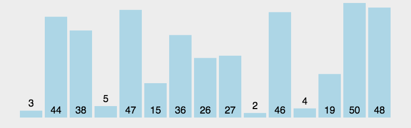

# 交换排序

## 1 冒泡排序
冒泡排序的基本思想是：从后往前（或从前往后）两两比较相邻元素的值，若为逆序（即A[i-1]>A[i]），则交换它们，直到序列比较完。我们称它为第一趟冒泡，结果是将最小的元素交换到待排序列的第一个位置（或将最大的元素交换到待排序列的最后一个位置），关键字最小的元素如气泡一般逐渐往上“漂浮”直至“水面”（或关键字最大的元素如石头一般下沉至水底）。

下一趟冒泡时，前一趟确定的最小元素不再参与比较，每趟冒泡的结果是把序列中的最小元素（或最大元素）放到了序列的最终位置……这样最多做n-1趟冒泡就能把所有元素排好序。

>性能分析
- 空间效率：仅使用了常数个辅助单元，因而空间复杂度为 $O(1)$。
- 时间效率：当初始序列有序时，显然第一趟冒泡后 flag 依然为 false（本趟冒泡没有元素交换），从而直接跳出循环，比较次数为 n-1，移动次数为 0，从而最好情况下的时间复杂度为 $O(n)$；当初始序列为逆序时，需要进行 n-1 趟排序，第 i 趟排序要进行 n-i 次关键字的比较，而且每次比较后都必须移动元素 3 次来交换元素位置。这种情况下

    比较次数=$\sum\limits^{n-1}_{i=1}(n-i)=\frac{n(n-1)}{2}$，移动次数=$\sum\limits^{n-1}_{i=1}3(n-i)=\frac{3n(n-1)}{2}$

    从而，最坏情况下的时间复杂度为 $O(n²)$，其平均时间复杂度也为 $O(n²)$

稳定性∶由于 i>j 且 A[]=A[] 时，不会发生交换，因此冒泡排序是一种稳定的排序方法。

注意∶冒泡排序中所产生的有序子序列一定是全局有序的（不同于直接插入排序），也就是说，有序子序列中的所有元素的关键字一定小于或大于无序子序列中所有元素的关键字，这样每趟排序都会将一个元素放置到其最终的位置上。

&emsp;
## 2 快速排序
快速排序的基本思想是基于分治法的∶在待排序表 L[1…n]中任取一个元素 pivot 作为枢轴（或基准，通常取首元素），通过一趟排序将待排序表划分为独立的两部分 L[1.k-1]和 L[k+1..n]，使得 L【1.k-1】中的所有元素小于 pivot，L【k+1..n】中的所有元素大于等于pivot，则pivot 放在了其最终位置L（k）上，这个过程称为一趟快速排序（或一次划分）。然后分别递归地对两个子表重复上述过程，直至每部分内只有一个元素或空为止，即所有元素放在了其最终位置上。
一趟快速排序的过程是一个交替搜索和交换的过程，下面通过实例来介绍，附设两个指针i 和j，初值分别为low和high，取第一个元素49为枢轴赋值到变量pivot。
指针j从high往前搜索找到第一个小于枢轴的元素27，将27交换到i所指位置。

